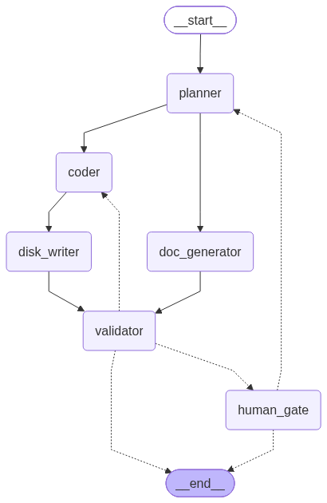

# Agentic SDLC Orchestrator & URL Shortener

## 1. Architecture Overview

This project implements a hybrid Agentic Software Engineering System. It consists of a Python-based LangGraph orchestrator that autonomously plans, writes, documents, and validates code for a C# .NET 10 Minimal API URL Shortener service.



### Orchestration Model & Control Flow

The orchestrator leverages a non-linear, stateful dependency graph composed of the following nodes:

- **Planner Node:** Interprets requirements and decomposes them into an actionable plan.
- **Parallel Execution (Fan-out/Fan-in):** The graph forks to execute two tasks simultaneously:
  - **Coder -> Disk Writer:** Modifies existing C# code and writes it to disk.
  - **Doc Generator:** Generates a Markdown API documentation file (`API_DOCS.md`).
- **Validator Node:** Acts as a synchronization point. It runs `dotnet build` to validate the generated C# code. If compilation fails, it routes the error back to the Coder for autonomous self-correction (bounded retry loop).
- **Human Gate Node:** Provides safe-stop controls and enforces human approval for high-impact actions. The user can approve the workflow or provide CLI feedback to dynamically re-plan and update the code.

## 2. Executed Scenarios

The system successfully executed the following engineering scenarios with full audit-grade observability:

- **Greenfield (New System):**
  - _Prompt:_ "Build a C# .NET 10 Minimal API URL shortener using SQLite."
  - _Execution:_ The agent generated the boilerplate `Program.cs`, defined the EF Core `AppDbContext` and `ShortUrl` model, and established the baseline `POST /shorten` and `GET /{shortCode}` endpoints.
- **Brownfield (Enhancement):**
  - _Prompt:_ "Add a Click tracking integer to the database and a new DELETE endpoint."
  - _Execution:_ The Coder read the existing codebase, correctly injected the schema migration, added the click increment logic to the `GET` endpoint, and appended the `DELETE` endpoint without destroying existing functionality. The Validator successfully verified the build.
- **Ambiguous Requirement:**
  - _Prompt:_ "Make the custom alias feature more reliable."
  - _Execution:_ The Planner autonomously interpreted "reliable" as requiring strict data validation. It directed the Coder to implement a 15-character length limit, lowercase normalization, and HTTP 400 Bad Request error handling.

## 3. Setup Instructions

### Prerequisites

- Python 3.10+
- .NET 10 SDK
- Google Gemini API Key

### Running the Orchestrator

1. Clone the repository and navigate to the root directory.
2. Install Python dependencies:

   ```bash
   pip install langgraph langchain-google-genai
   ```

3. Export your API key:
   export GEMINI_API_KEY="your-api-key-here"

4. Run the orchestrator
   python3 orchestrator/main.py

5. Approve or reject the changes at the CLI Human Gate. Final execution telemetry (latency, retry frequency, MTTR) will print upon completion.

### Running the C# Target Application

1. Navigate to the target project directory:
   cd src/UrlShortener

2. Start the Minimal API server:
   dotnet run

## 4. Testing, Limitations, and Trade-offs

Validation Approach: We utilize a "Shift-Left" validation strategy. The validator_node runs a strict dotnet build to catch syntactic and structural errors before a human ever reviews the code.

File Scope vs. Workspace Scan: To manage LLM context windows and prevent rate-limit exhaustion, the orchestrator explicitly targets and rewrites specific files rather than parsing the entire workspace on every loop.

Limitation: The validation currently relies on compile-time checks (dotnet build). Future iterations should implement runtime verification (dotnet test) to validate complex business logic autonomously.

## 5. Final Engineering Summary

This system demonstrates controlled agent autonomy. By encapsulating the LLM within a strict LangGraph state machine, we mitigate the risk of infinite loops and hallucinated destructive changes. The explicit retry circuit breaker prevents runaway token consumption, while the parallel documentation node proves the system can handle stateful, synchronized task execution. Ultimately, the agents act as the executor, but the explicit human_gate_node ensures the human developer retains absolute ownership over final quality and release readiness.
